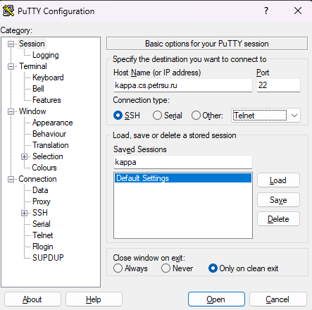
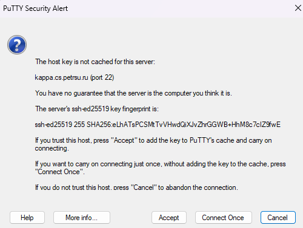
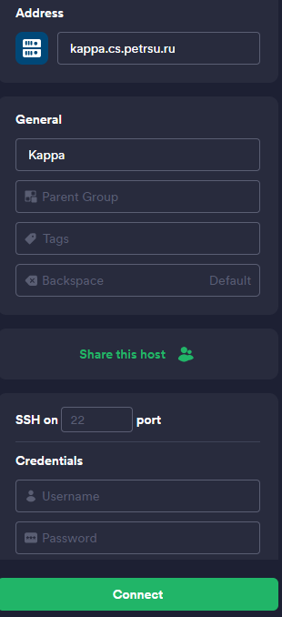
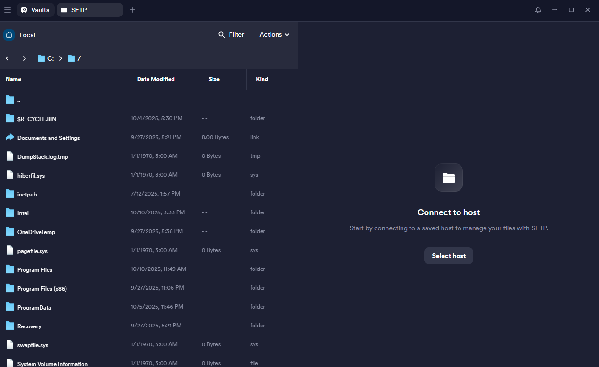

# Hello, Students

## Вводная

Выполнять лабораторные работы нам предлагается на дистрибутиве Linux `OpenSUSE`, в ходе конкретно этой лабы нам нужно создать программу на С которая просто выведет текст `Hello, students!` в консоль.

предоставленные фрагменты кода:

```C title="main.c" linenums="1" hl_lines="4"
/**
 * main.c -- программа "Hello, students!"
 *
 * Copyright (c) 2022, First Last <student@cs.petrsu.ru>
 *
 * This code is licensed under MIT license.
 */

#include <stdio.h>

int main()
{
    /* Выводим приветствие */
    fprintf(stdout, "Hello, students!\n");

    return 0;
}
```

```make title="Makefile" linenums="1"
# цель по умолчанию (при вызове make или make task1)
# собираем программу task1 из объектного файла task1.o
task1: main.o
    gcc -g -O0 -o task1 main.o

main.o: main.c
    gcc -g -O0 -c main.c

# цель clean (при вызове make clean)
# удаляем программу и объектные файлы
clean:
    rm task1 *.o
```

## Этапы выполнения

### Создание директории лабы

изначально мы имеем следующую структуру директорий:

```plaintext
└── 📁 user
    ├── 📁 Видео
    ├── 📁 Документы
    ├── 📁 Загрузки
    ├── 📁 Изображения
    ├── 📁 Музыка
    ├── 📁 Общедоступные
    ├── 📁 Рабочий стол
    ├── 📁 Шаблоны
    └── 📁 bin
```

нам же нужно создать новую директорию `inf`, перейти в неё и в неё создать ещё 1 директорию, `task1`. для этого нужно использовать команды `mkdir` и `cd` (ну или просто в проводнике правой кнопкой мыши - создать)

```bash
<логин>@kappa~> mkdir inf
```

тут мы создали директорию `inf`, теперь нужно в неё перейти:

```bash
<логин>@kappa~> cd inf
```

теперь мы находимся в директории `inf`, по аналогии создаём директорию `task1` и переходим в неё:

```bash
<логин>@kappa~/inf> mkdir task1
<логин>@kappa~/inf> cd task1
```

### Файлы программы

После того как мы создали все нужные директории нам необходимо создать сами файлы программы, main.c и Makefie

```bash
<логин>@kappa~/inf/task1> touch main.c
<логин>@kappa~/inf/task1> touch Makefile
```

по итогу мы получаем следующую структуру директорий и файлов:

```plaintext
└── 📁 <логин>
    ├── 📁 ...
    └── 📁 inf
        └── 📁 task1
            ├── 📄 main.c
            └── 📄 Makefile

```

Теперь можно приступать к самому написанию программы, начнём с `main.c`, чтобы начать работу нужно его открыть через `emacs`:

```bash
<логин>@kappa~/inf/task1> emacs main.c
```

после этого нужно написать код из вводной, но с некоторыми изменениями:

- строка 4: Заменить `First Last` на ваши имя и фамилию
- строка 4: Заменить в адресе эл.почты `student` на ваш логин от kappa

после того как вы измените и напишите всё нужное файл можно сохранять, чтобы это сделать нужно использовать сочетание клавиш ++ctrl+"X"++, после чего нажать ++"S"++. После этого emacs спросит нужно ли сохранять их, нажимаем ++"Y"++ и готово. можно переходить в файл `Makefile`, для этого зажимаем ++ctrl+"X"++ после чего ++ctrl+"F"++, вводим `Makefile`. После этого откроется наш Makefile, в него также нужно написать код из вводной

### Сборка программы и запуск

После того как все файлы созданы и код написан нужно скомпилировать программу и запустить её, для этого мы будем использовать `make`. вводим в консоль:

```bash
<логин>@kappa~/inf/task1> make
```

в директории программы появятся новые файлы:

```plaintext
└── 📁 task1
    ├── 📄 main.c
    ├── 📄 main.o
    ├── 📄 task1
    └── 📄 Makefile
```

??? warning "Если make выдаёт ошибку"

    Для начала удостоверьтесь что вы находитесь в директории ++"task1"++, если это так, но всё равно появляется ошибка, то удалите все табы в Makefile и проставьте их заново

чтобы запустить программу нужно ввести в консоль следующее:

```bash
<логин>@kappa~/inf/task1> ./task1
```

программа выводит нужный текст в консоль, значит всё работает нормально

### изменения в Makefile

нам нужно создать новую цель: `indent`. для этого открываем Makefile через emacs и добавляем эти строки:

```make title="Makefile" linenums="1" hl_lines="9 10"
# цель по умолчанию (при вызове make или make task1)
# собираем программу task1 из объектного файла task1.o
task1: main.o
 gcc -g -O0 -o task1 main.o

main.o: main.c
 gcc -g -O0 -c main.c

indent:
    indent -kr -nut main.c

# цель clean (при вызове make clean)
# удаляем программу и объектные файлы
clean:
 rm task1 *.o
```

теперь если мы введём в консоль `make indent` то наш исходный код в `main.c` будет отформатирован под стиль ++"K&R"++

### Подключение к Kappa

=== "ssh"

    Для подключения к удалённому серверу `Kappa` через ssh нужно открыть консоль и прописать следующую команду:

    ```sh
    ssh <логин>@kappa.cs.petrsu.ru
    ```

    после этого начнётся подключение и вы увидите вопрос, `Are you sure you want to continue connecting (yes/no/[fingerprint])?`, пишем yes и нажимаем ++enter++. Потом Kappa запросит ваш пароль, нужно тоже его ввести и нажать ++enter++

    !!! warning "Важно"

        При вводе пароля набранные вами символы не отображаются, консоль не зависла, это сделано специально

=== "PuTTY"

    Чтобы подключиться к Kappa через PuTTY, необходимо ввести адрес сервера (1), также для удобства можно дать название профилю и сохранить его, для этого нужно ввести название в поле ввода `Saved sessions` и нажать `save`. Чтобы подключиться нажимаем внизу `open`.
    { .annotate }

    1. kappa.cs.petrsu.ru

    <figure markdown="span">
        { width="100%" }
        <figcaption>Создание сессии</figcaption>
    </figure>

    После того как мы начали подключение, PuTTY может выдать следующее сообщение:

    <figure markdown="span">
        { width="100%" }
    </figure>

    Нажимаем `accept`, далее вводим свой логин и пароль кода запросят.

    !!! warning "Важно"

        При вводе пароля набранные вами символы не отображаются, консоль не зависла, это сделано специально

=== "Termius"

    Чтобы подключиться к Kappa через Termius нужно нажать `new host`, и в меню слева ввести данные. В Address указываем адрес сервера (1), в `Label` можете назвать подключение как хотите. В `Credentials` нужно ввести свой логин и пароль.
    { .annotate }

    1. kappa.cs.petrsu.ru

    <figure markdown="span">
        { width="100%" }
        <figcaption>Создание сессии</figcaption>
    </figure>

    после этого нажимаем `connect`

### Перенос файлов на удалённый сервер

Если вы работаете на комах в кабинете информатики под своим логином и паролем то можно не париться, та все файлы автоматически синхронизируются. Что касается других случаев то есть несколько способов

=== "переписать"

    Самый простой в реализации метод, но в то же время и самый долгий. Для этого вам нужно подключиться по ssh к kappa, после чего создать там файлы и переписывать в консоли через emacs или другой редактор, например Vim

=== "scp"

    Перекинуть файл можно через команду терминала `scp`, её синтаксис выглядит следующим образом:

    ```sh
    scp путь_до_нужного_файла <логин>@kappa.cs.petrsu.ru:/путь_куда_сохранять
    ```

    для того чтобы перекинуть файл `main.c` в директорию нашей лабы нужно выполнить следующее:

    ```sh
    scp main.c <логин>@kappa.cs.petrsu.ru:/home/01/user/inf/task1
    ```

    После выполнения данной команды файл будет отправлен по указанному пути

    !!! warning "Важно"

        путь куда сохранять может отличаться в зависимости от пользователя. По дефолту вы находитесь в /home/01/логин, но это может отличаться. Чтобы избежать ошибок с этим следует подключиться к kappa по ssh и ввести команду `pwd`, она покажет текущую директорию, при подключении мы находимся в домашней, так что это то, что нужно

=== "Termius"

    Это пожалуй самый простой и быстрый способ, когда вы на своём компе всё написали, нужно зайти в Termius и перейти на вкладку `SFTP`, и там нажать справа `Select host`. 

    <figure markdown="span">
        { width="100%" }
        <figcaption>Подключение по SFTP</figcaption>
    </figure>

    Выбираем созданное раннее подключение, после чего как в обычном проводнике переходим в нужную директорию на сервере, левая половина это наши локальные файлы, ищем папку в которой вы всё делали, и после этого просто перетаскиваем файлы с левой половины на правую

## Типичные ошибки

??? danger "bash: gcc: command not found"
    GCC не установлен или не в PATH. На Kappa он должен быть. 
    Попробуйте `which gcc`. Если не помогает - помянем

??? danger "make: *** No targets specified and no makefile found"
    Вы не в той директории. Проверьте через `pwd` — должны быть в `task1/`.
    Также убедитесь что файл называется именно `Makefile` (с большой M)

??? danger "Permission denied при запуске ./task1"
    Файл не имеет прав на выполнение. Выполните `chmod +x task1` или 
    пересоберите через `make clean && make`

## Возможные вопросы на сдаче

??? question "Что такое gcc?"

    !!! success "Ответ"
        
        GCC это компилятор, с помощью которого мы из файлов с исходным кодом, который понятен человеку, сделать машинный код, который понятен компьютеру

??? question "что значат параметры которые мы передаём gcc?"

    !!! success "Ответ"

        Флаг ++"-g"++ включает добавление отладочной информации в готовую программу, как если бы мы упаковывали какой то товар и клали туда инструкцию. Флаг ++"-O0"++ отключает оптимизацию от компилятора. Флаг ++"-c"++ компилирует .с файл в объектный файл. Флаг ++"-о"++ задаёт имя файла программы который мы получаем на выходе

??? question "Что такое make?"

    !!! success "Ответ"

        make это утилита автоматизации процесса сборки программы из исходного кода. Вместо того, что бы вводить кучу раз ряд команд, мы можем добавить цель, зависимость для неё, и сказать что нужно сделать

??? question "Что значат параметры которые мы передаём make indent?"

    !!! success "Ответ"

        <div class="annotate" markdown>

        - Флаг ++"-kr"++: задаёт стандарт оформления K&R (1)
        - Флаг ++"-nut"++: включает проверку правильности пробелов и табуляций

        </div>

        1. Керниган и риччи

??? question "что значит строка '#include < stdio.h>'?"

    !!! success "Ответ"

        Директива препроцессора `#include` говорит компилятору, что до этапа компиляции нам нужно вставить в это место содержимое некого заголовочного файла. `<stdio.h>` указывает на необходимый заголовочный файл, и т.к. это часть стандартной библиотеки С то название пишем в < >. `stdio.h` даёт нам доступ к стандартному вводу/выводу