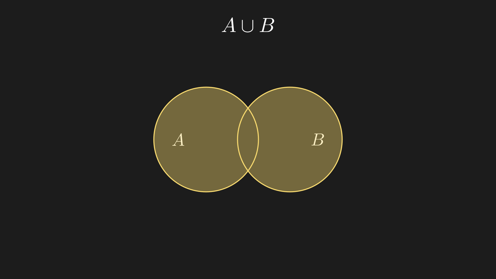
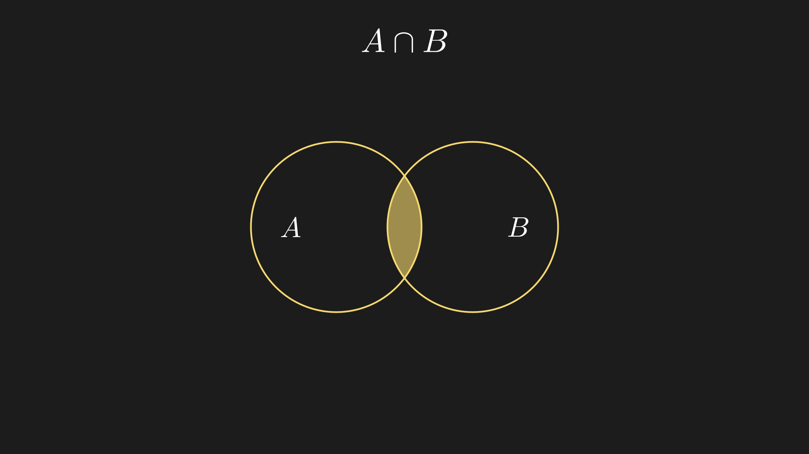
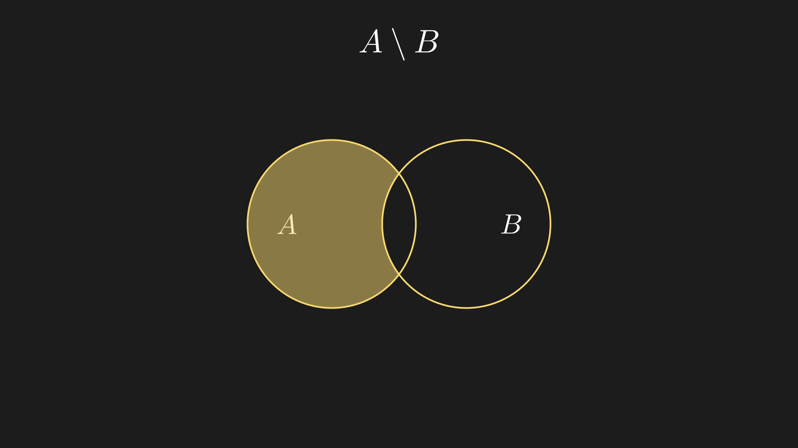
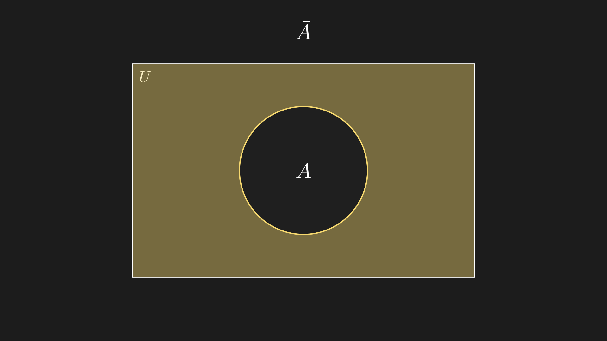
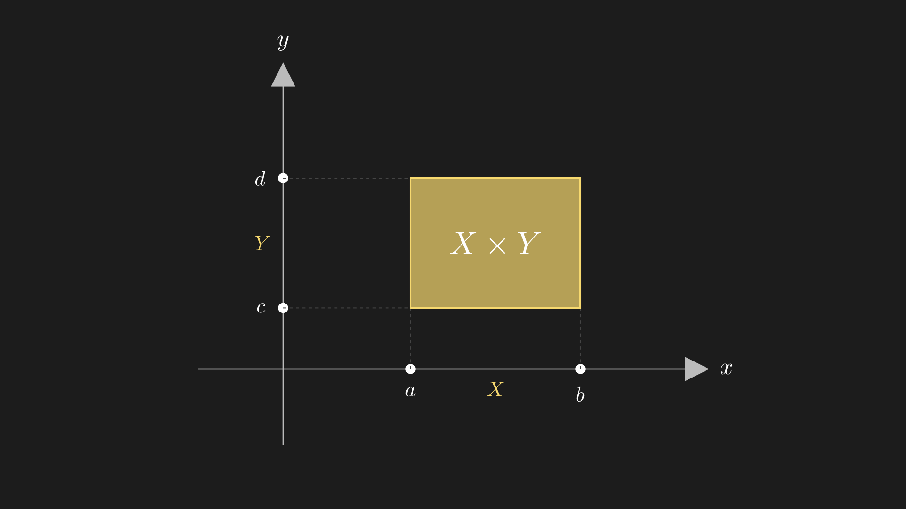

## 2.1 Объединение

**Объединение** (обозначается $A \cup B$) - это операция, которая создает новое множество из **всех** элементов обоих множеств

!!! abstract "Определение"
    $$A \cup B = \{x : x \in A \lor x \in B\}$$
    
    где $\lor$ - логическое «ИЛИ» (дизъюнкция)

### Графическое представление

{: style="width: 100%; max-width: 600px; border-radius: 16px;"}

**Закрашенная область** - это все элементы, которые принадлежат **хотя бы одному** из множеств $A$ или $B$

### Примеры

**Пример 1:** Множества с общими элементами

$$A = \{1, 2, 3\}$$

$$B = \{3, 4\}$$

$$A \cup B = \{1, 2, 3, 4\}$$

!!! note "Важно"
    Элемент $3$ встречается в обоих множествах, но в объединении он записывается **только один раз**!

**Пример 2:** Множества без общих элементов

$$A = \{1, 2, 3\}$$

$$B = \{4\}$$

$$A \cup B = \{1, 2, 3, 4\}$$

### Свойства объединения

1. **Коммутативность**: $A \cup B = B \cup A$
2. **Ассоциативность**: $(A \cup B) \cup C = A \cup (B \cup C)$
3. **Идемпотентность**: $A \cup A = A$
4. **Пустое множество**: $A \cup \varnothing = A$

---

## 2.2 Пересечение

**Пересечение** (обозначается $A \cap B$) - это операция, которая создает новое множество только из **общих** элементов обоих множеств

!!! abstract "Определение"
    $$A \cap B = \{x : x \in A \land x \in B\}$$
    
    где $\land$ - логическое «И» (конъюнкция)

### Графическое представление

{: style="width: 100%; max-width: 600px; border-radius: 16px;"}

**Закрашенная область** (середина) - это элементы, которые принадлежат **одновременно** и $A$, и $B$

### Примеры

**Пример 1:** Есть общие элементы

$$A = \{1, 2, 3\}$$

$$B = \{3, 4\}$$

$$A \cap B = \{3\}$$

**Пример 2:** Нет общих элементов (непересекающиеся множества)

$$A = \{1, 2, 3\}$$

$$B = \{4\}$$

$$A \cap B = \varnothing$$

!!! tip "Терминология"
    Если $A \cap B = \varnothing$, множества называются **непересекающимися** или **дизъюнктными**.

### Свойства пересечения

1. **Коммутативность**: $A \cap B = B \cap A$
2. **Ассоциативность**: $(A \cap B) \cap C = A \cap (B \cap C)$
3. **Идемпотентность**: $A \cap A = A$
4. **Пустое множество**: $A \cap \varnothing = \varnothing$
5. **дистрибутивность**: $A \cap (B \cup C) = (A \cap B) \cup (A \cap C)$

---

## 2.3 Разность

**Разность** (обозначается $A \setminus B$) - это операция, которая создает новое множество из элементов $A$, **не входящих** в $B$

### Графическое представление

{: style="width: 100%; max-width: 600px; border-radius: 16px;"}

**Закрашенная область** - это элементы, которые принадлежат $A$, но **не принадлежат** $B$

### Примеры

**Пример 1:** Частичное пересечение

$$A = \{1, 2, 3\}$$

$$B = \{3, 4\}$$

$$A \setminus B = \{1, 2\}$$

!!! warning "Важно"
    Разность **не коммутативна**! $A \setminus B \neq B \setminus A$

**Пример 2:** Множества без пересечения

$$A = \{1, 2, 3\}$$

$$B = \{4\}$$

$$A \setminus B = \{1, 2, 3\} = A$$

### Свойства разности

1. **Не коммутативна**: $A \setminus B \neq B \setminus A$ (в общем случае)
2. $A \setminus A = \varnothing$
3. $A \setminus \varnothing = A$
4. $\varnothing \setminus A = \varnothing$
5. $A \setminus B = A \cap B^c$ (где $B^c$ - дополнение $B$)

---

## 2.4. Дополнение

!!! abstract "Определение"
    $$\bar{A} = \{x \in U : x \notin A\}$$
    
    где $U$ - универсальное множество (множество, содержащее все рассматриваемые в данном контексте элементы)

### Графическое представление

{: style="width: 100%; max-width: 600px; border-radius: 16px;"}

**Закрашенная область** - это все элементы универсального множества $U$ (прямоугольник), которые **не принадлежат** множеству $A$ (круг).

### Примеры

**Пример 1:** Числовые множества

Пусть универсальное множество $U = \{1, 2, 3, 4, 5, 6, 7, 8, 9, 10\}$

$$A = \{2, 4, 6, 8, 10\} \quad \text{(чётные числа)}$$

$$\bar{A} = \{1, 3, 5, 7, 9\} \quad \text{(нечётные числа)}$$

**Пример 2:** Геометрический смысл

Пусть $U$ - множество всех точек на плоскости, $A$ - множество точек внутри окружности радиуса $R$.

$$\bar{A} = \text{все точки плоскости вне окружности (включая саму окружность)}$$

### Свойства дополнения

1. **Двойное дополнение**: $\overline{\bar{A}} = A$
2. **Дополнение универсального множества**: $\bar{U} = \varnothing$
3. **Дополнение пустого множества**: $\bar{\varnothing} = U$
4. **Закон исключённого третьего**: $A \cup \bar{A} = U$
5. **Закон противоречия**: $A \cap \bar{A} = \varnothing$
6. **Законы де Моргана**:
   - $\overline{A \cup B} = \bar{A} \cap \bar{B}$

   - $\overline{A \cap B} = \bar{A} \cup \bar{B}$

!!! tip "Интуитивное понимание"
    Дополнение - это как "всё, кроме"

---

## 2.5. Декартово (прямое) произведение множеств

**Декартово произведение** (обозначается $A \times B$) - это операция, которая создает множество всех возможных **упорядоченных пар** $(x, y)$, где первый элемент $x$ взят из множества $A$, а второй элемент $y$ - из множества $B$

!!! abstract "Определение"
    $$A \times B = \{(x, y) : x \in A,  y \in B\}$$
    
    где $(x, y)$ - **упорядоченная пара**, то есть $(x, y) \neq (y, x)$, если $x \neq y$

### Графическое представление

{: style="width: 100%; max-width: 500px; border-radius: 8px;"}

У нас 2 множества $X\{a,b\}$ и $Y\{c,d\}$, их декартовое произведение будет каждой точкой этого прямоугольника: $\{(a,c),(a,d),(b,c),(b,d)\}$

### Примеры

**Пример 1:** Конечные множества

$$A = \{1, 2\}$$

$$B = \{a, b\}$$

$$A \times B = \{(1, a), (1, b), (2, a), (2, b)\}$$

!!! warning "Важно"
    Декартово произведение **не коммутативно**!

    $$B \times A = \{(a, 1), (a, 2), (b, 1), (b, 2)\} \neq A \times B$$

**Пример 2:** Числовые множества

$$A = \{0, 1\}$$

$$B = \{0\}$$

$$A \times B = \{(0, 0), (1, 0)\}$$

Это множество точек на координатной плоскости: $(0, 0)$ и $(1, 0)$.

**Пример 3:** Декартов квадрат

$$A = \{0, 1, 2, 3\}$$

$$A \times A = \{(0,0), (0,1), (0,2), (0,3), (1,0), (1,1), \ldots, (3,3)\}$$

Всего $4 \times 4 = 16$ упорядоченных пар

### Свойства декартова произведения

1. **Не коммутативно**: $A \times B \neq B \times A$ (в общем случае)
2. **Мощность**: $|A \times B| = |A| \cdot |B|$ (количество элементов)
3. **Ассоциативность**:
   Формально $(A \times B) \times C$ и $A \times (B \times C)$ — разные множества (разная структура скобок: $((a,b),c)$ vs $(a,(b,c))$), но между ними есть естественное взаимно однозначное соответствие, поэтому на практике их считают одинаковыми и пишут просто $A \times B \times C$ — множество троек $(a, b, c)$

4. **Дистрибутивность относительно объединения**:
   - $A \times (B \cup C) = (A \times B) \cup (A \times C)$
   - $(A \cup B) \times C = (A \times C) \cup (B \times C)$
5. **Дистрибутивность относительно пересечения**:
   - $A \times (B \cap C) = (A \times B) \cap (A \times C)$
6. **С пустым множеством**: $A \times \varnothing = \varnothing \times A = \varnothing$

!!! example "Практическое применение"
    Декартово произведение - это основа **координатной геометрии**. 
    - $\mathbb{R} \times \mathbb{R} = \mathbb{R}^2$ - плоскость (все точки с координатами $(x, y)$)
    - $\mathbb{R} \times \mathbb{R} \times \mathbb{R} = \mathbb{R}^3$ - трёхмерное пространство

---

## 📊 Сводная таблица всех операций

| Операция | Обозначение | Определение | Пример |
|----------|-------------|-------------|--------|
| **Объединение** | $A \cup B$ | $\{x : x \in A \lor x \in B\}$ | $\{1,2\} \cup \{2,3\} = \{1,2,3\}$ |
| **Пересечение** | $A \cap B$ | $\{x : x \in A \land x \in B\}$ | $\{1,2\} \cap \{2,3\} = \{2\}$ |
| **Разность** | $A \setminus B$ | $\{x : x \in A \land x \notin B\}$ | $\{1,2\} \setminus \{2,3\} = \{1\}$ |
| **Дополнение** | $\bar{A}$ | $\{x \in U : x \notin A\}$ | $\overline{\{1,2\}} = \{3,4,...\}$ (в $U=\{1,2,3,4\}$) |
| **Декартово произведение** | $A \times B$ | $\{(x,y) : x \in A, y \in B\}$ | $\{1\} \times \{a\} = \{(1,a)\}$ |
